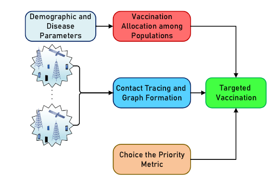

# Targeted Vaccination wit Wireless Contact Tracing Data

## Abstract
With the emergence of the Covid-19 disease in late 2019, a wave of
researchers' efforts began to find appropriate ways to prevent the uncontrollable
spread of this disease and reduce its casualties. One highly effective tool in this
domain is the utilization of wireless technology infrastructure and contact tracing of
individuals. Through this approach, intelligent allocation of vaccines can be
employed to optimize vaccination efficacy within the community, predict the risk
of Covid-19 infection, and implement preventive measures against its spread.
In this project, an attempt has been made to employ neural graph networks and
novel representation learning methods to first process the collected data from
wireless telecommunication networks or peer-to-peer wireless communications.
These data are then fed into the mentioned algorithms to obtain an algebraic
representation of the presented graphs. Subsequently, utilizing clustering
algorithms in the transformed representation space allows the identification of
distinct communities within the graph. By prioritizing these groups and allocating
the necessary vaccines accordingly, the effectiveness of vaccination in creating
immunity against the disease can be enhanced. Finally, an experimental software
package has been developed to receive and transmit contact tracing data in order to
create a user interface.

## Project Description
In this project, I have developed and tested Graph Representation Learning methods for graph embedding and clustering. The main steps in targeted vaccination are illustrated here:
